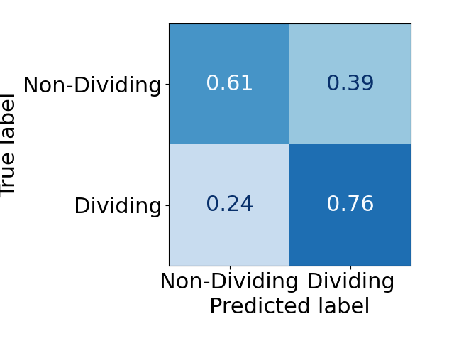

# Raw data and scripts to generate all figures from the paper

## MAIN

* Figure 2 
  * **b) Cumulative plots for the Synaptic Proteins dataset**
    * Data :   
    * Script : execute `python fig2_confusion_matrix.py` to generate the cumulative plots and save them as pdf and png files.
    
    
    
    
  * **e) Confusion matrices for the S. Aureus dataset**
    * Data : labels and predictions (False for dividing cells and True for non-dividing cells) for the 410 cells from the test images for the 5 methods compared (brightfield, pix2pix, TA-GAN trained with LR labels, TA-GAN trained with HR labels, SIM)  
    * Script : execute `python fig2_confusion_matrix.py` to generate the confusion matrices and save them as pdf and png files.
    
    
    

* Figure 4 
  * **c**
    * Data :   
    * Script : 
  * **d**
    * Data :   
    * Script : 
  * **e**
    * Data :   
    * Script : 
  * **h**
    * Data :   
    * Script : 
  * **i**
    * Data :   
    * Script : 

## SUPP
TODO

